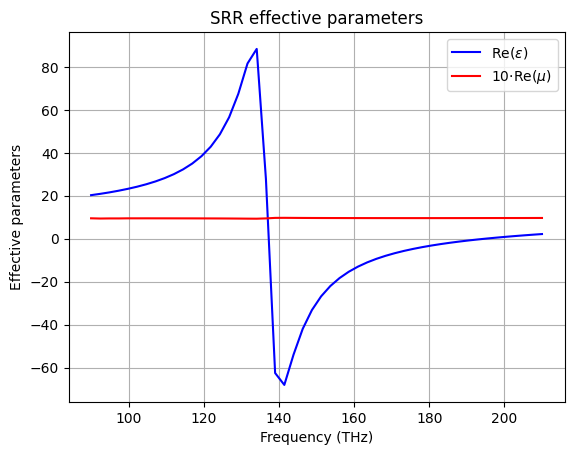

## Split Ring Resonators

These examples show the simulation of a metamaterial comprised of gold Split Ring Resonators (SRRs) and the retrieval of its effective parameters.

The script `srr.py` contains the simulation of the SRRs and the retrieval of the effective parameters. It can be run via the command line:
``` bash
$ python examples/srr/srr.py
```
The simulation is in 3D and takes some time, so there is the possibility of running it in parallel using MPI. To run the example in parallel use:
``` bash
$ ./run_srr.sh
```
After the simulation, we will get the effective permittivity and permeability of the metamaterial. In the plot we can see clearly how the resonance produces an effective negative index at a range of frequencies between 137 and 195 THz.

