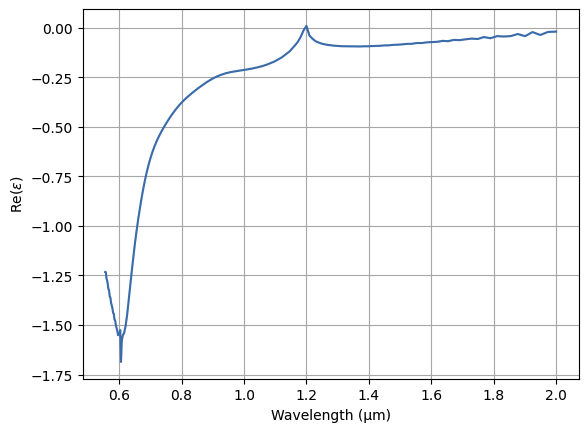
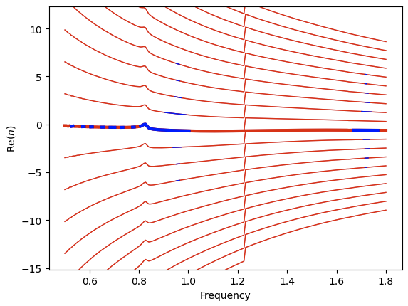

# Effective parameter retrieval

These functions are used the retrieval of the effective parameters of a metamaterial. The calculations made are based on Chen et al., *Robust method to retrieve the constitutive effective parameters of metamaterials*, Phys. Rev. E, vol. 70, pp. 016608-1-016608-7.
With this method we can get the effective permittivity $\varepsilon$, permeability $\mu$, index of refraction $n$ and impedance $z$ of a metamaterial given the S-parameters and the thickness.

## Example
Following the example on the main documentation, we can easily retrieve the effective parameters of the square grating.
    
```python
from meep_metamaterials.retrieval import retrieval

params = retrieval.eff_parameters(freq_range, .2, S11, S21, continuity=True)
permittivity = params['eps']
```
With this we can rapidly obtain the effective permittivity of the metamaterial for example.



Also with the option `plot_branches=True` we can see the branches of the complex cosine used to get the effective index $n$.




## Retrieval
The formulas used to get the effective parameters are:
$$z = \pm\sqrt{\frac{(1+S_{11})^2-S_{21}^2}{(1-S_{11})^2-S_{21}^2}}$$
$$e^{ink_0d}=\frac{S_{21}}{1-S_{11}\frac{z-1}{z+1}}$$
$$n=\frac1{k_0d}(-i\ln e^{ink_0d}+2m\pi)$$
where $m$ is the selected branch.

